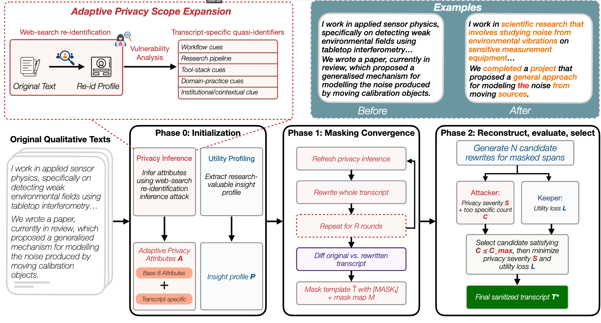

# AURA: Adaptive Utility-preserving Re-identification-resistant Anonymization

[](https://www.python.org/downloads/)
[](https://pypi.org/project/openai/)
[](https://pypi.org/project/python-dotenv/)
[](https://pypi.org/project/google-genai/)
[](LICENSE)



## 📚 Contents

- [ℹ️ About](#about)
- [📁 Repository layout](#repository-layout)
- [🚀 Quick start](#quick-start)
- [🔬 Reproducing the paper](#reproducing-the-paper)
- [🔒 Privacy notes](#privacy-notes)
- [🙏 Acknowledgements](#acknowledgements)
- [📝 Citation](#citation)
- [📄 License](#license)


## ℹ️ About

This repository contains the implementation and evaluation harness for
**AURA**, a privacy-rewriting pipeline that anonymizes interview-style
conversation transcripts while preserving downstream qualitative utility.
The pipeline iterates between a **Masker** that proposes [MASK_i] spans
on a span level, a **Refiller** that fills them in with privacy-preserving
generalizations, and an **Attacker / Keeper** pair that adversarially
probes the rewrite to decide whether further masking is needed.  An
**adaptive-privacy** wrapper additionally probes each transcript with web
search to discover transcript-specific privacy attributes that are not
covered by the eight base attributes (age, sex, location, occupation,
education, relationship status, income, place of birth).


## 📁 Repository layout 

```
aura/                             # repo root (name from `git clone`)
├── README.md                     # this file
├── LICENSE                       # MIT
├── .gitignore
├── requirements.txt              # combined deps for both subfolders
│
├── AURA/                         # the AURA pipeline itself
│   ├── README.md
│   ├── requirements.txt
│   ├── .env.example
│   ├── pipeline.py               # 4-phase rewrite (run-one / run-all)
│   ├── phase0_init.py            # load JSONL into the SQLite scratch DB
│   ├── run_expanded_privacy.py   # adaptive-privacy wrapper (recommended entry point)
│   ├── run_pure_adaptive_attri.py
│   ├── run_openrouter_sample.py
│   ├── phase{0,1,2}*.py          # phase implementations
│   ├── pipeline_config.py
│   ├── db.py
│   └── input/example_transcripts.jsonl   # synthetic example
│
└── EVAL/                         # re-identification & utility evaluation
    ├── README.md
    ├── requirements.txt
    ├── _compat.py                # vendored constants and CSV helpers
    ├── direct_intent.py          # web-search re-id over a CSV of transcripts
    ├── identifier_profile_preservation.py
    ├── evaluate_code_fact_recoverability.py
    └── input/adaptive_attri/example_rewritten.csv   # synthetic example
```

The two subfolders are independent: `EVAL/` operates on
CSVs and JSONs and never imports from `AURA/`.

## 🚀 Quick start

All commands below assume you cloned into a folder named `aura` and are
using **Python 3.10+**.  On macOS, use `python3` / `pip3` if `python` /
`pip` are not on your PATH.

```bash
git clone <this-repo> aura && cd aura

# 1. Install dependencies.
python3 -m venv .venv && source .venv/bin/activate
pip install -r requirements.txt

# 2. Configure API keys in AURA/.env
cp AURA/.env.example AURA/.env
nano AURA/.env   # or: cursor AURA/.env
#   OPENAI_API_KEY=...        required for GPT runs and web-search re-id
#   OPENROUTER_API_KEY=...    required for OpenRouter / Qwen rewrite runs

cd AURA
```

### Privacy scope × provider

Three privacy scopes are supported.  Run these from the `AURA/` folder
(the inner pipeline directory).

| Scope | What is protected | GPT (OpenAI) | OpenRouter (Qwen) |
|---|---|---|---|
| **Base only** | 8 predefined attributes only | `python run_expanded_privacy.py --reset-db --only-base-attri` | Set OpenRouter vars in `.env` (below), then `python run_expanded_privacy.py --reset-db --only-base-attri` |
| **Adaptive** | Base 8 + dynamically discovered attributes | `python run_expanded_privacy.py --reset-db` | Set OpenRouter vars in `.env`, then the same command |
| **Pure adaptive** | Dynamically discovered attributes only (no base 8) | `python run_pure_adaptive_attri.py --reset-db` | Set OpenRouter vars in `.env`, then the same command |

Default CSV outputs:

| Scope | Output CSV |
|---|---|
| Base only | `output/adaptive_attri/nobranch_rewritten.csv` |
| Adaptive | `output/adaptive_attri/nobranch_rewritten.csv` |
| Pure adaptive | `output/pure_adaptive_attri/pure_adaptive_attri_rewritten.csv` |

**Recommended first run** (adaptive scope, GPT):

```bash
python run_expanded_privacy.py --reset-db
# → output/adaptive_attri/nobranch_rewritten.csv
```

#### OpenRouter setup

Set these in `AURA/.env` (or `export` them in your shell).  Web-search re-id
(steps 1 and 4) still uses OpenAI, so keep both keys configured.
`NB_DISABLE_REASONING=1` is recommended for Qwen models.

```bash
NB_LLM_PROVIDER=openrouter
NB_MASKER_MODEL=qwen/qwen3.5-27b
NB_REFILLER_MODEL=qwen/qwen3.5-27b
NB_ATTACKER_MODEL=qwen/qwen3.5-27b
NB_KEEPER_MODEL=qwen/qwen3.5-27b
NB_INIT_MODEL=qwen/qwen3.5-27b
NB_MODULATOR_MODEL=qwen/qwen3.5-27b
NB_DISABLE_REASONING=1

python run_expanded_privacy.py --reset-db --only-base-attri   # base 8 on Qwen
# python run_expanded_privacy.py --reset-db                  # adaptive on Qwen
# python run_pure_adaptive_attri.py --reset-db               # pure adaptive on Qwen
```

### Evaluate the rewrite

```bash
cd ../EVAL
python direct_intent.py ../AURA/output/adaptive_attri/nobranch_rewritten.csv
# → web_search_nobranch_rewritten.csv.json
```

### Common CLI flags

Flags below apply to `run_expanded_privacy.py` and
`run_pure_adaptive_attri.py` unless noted.  Run `--help` on any script for
the full list.

| Flag | Default | Notes |
|---|---|---|
| `--reset-db` | off | Delete the SQLite scratch DB before running. |
| `--only-base-attri` | off | Skip adaptive attribute discovery; protect only the 8 base attributes. Mutually exclusive with `--no-base-attributes`. |
| `--no-base-attributes` | off | Pure-adaptive mode: skip the base 8 (forced by `run_pure_adaptive_attri.py`). |
| `--skip-reid` | off | Run the rewrite pipeline only; skip web-search re-id on rewritten outputs. |
| `--input` | `input/example_transcripts.jsonl` | Source transcript JSONL (`conversation_id`, `user_message`). |
| `--export-dir` | scope-specific | Directory for CSV, attribute JSON, and re-id artifacts. |
| `--name-prefix` | `nobranch` or `pure_adaptive_attri` | Filename prefix for exported artifacts. |
| `--ids` | all rows | Comma-separated transcript IDs to process. |
| `--feedback-rounds` | `1` | Re-run pipeline on still-re-identified transcripts (adaptive scope only; skipped with `--only-base-attri`). |
| `--max-new-attributes` | `12` | Cap on new dynamic attributes per transcript per round. |
| `--max-total-attributes` | `12` | Cap on total attributes per transcript (base + dynamic). |
| `--direct-intent-model` | `gpt-5.1` | Model for web-search re-id probes (OpenAI only). |
| `--attribute-model` | `gpt-4.1` | Model for dynamic attribute generation. |

OpenRouter model selection (set in `AURA/.env`, not CLI flags):

| Variable | Example | Notes |
|---|---|---|
| `NB_LLM_PROVIDER` | `openrouter` | Route pipeline LLM calls through OpenRouter. |
| `NB_MASKER_MODEL` | `qwen/qwen3.5-27b` | Model for all pipeline phases unless overridden per phase. |
| `NB_DISABLE_REASONING` | `1` | Recommended for Qwen; avoids slow hidden reasoning on OpenRouter. |

API keys by path:

| Path | `OPENAI_API_KEY` | `OPENROUTER_API_KEY` |
|---|---|---|
| `run_expanded_privacy.py` / `run_pure_adaptive_attri.py` (default GPT) | pipeline + re-id + attribute gen | — |
| Same scripts + `NB_LLM_PROVIDER=openrouter` | re-id (always) | pipeline + attribute gen |

For the lower-level two-step flow (`phase0_init.py` → `pipeline.py run-all`,
SQLite only, no CSV export), see [`AURA/README.md`](AURA/README.md).

For details on every CLI flag, see the per-folder READMEs:

* [`AURA/README.md`](AURA/README.md) — pipeline,
  adaptive variants, and OpenRouter / Qwen on-device runs.
* [`EVAL/README.md`](EVAL/README.md) —
  re-identification and utility evaluation harness.

## 🔬 Reproducing the paper

The paper reports three families of results, each driven by code in this
repository:

1. **Adaptive-privacy rewrites** under different LLM backbones
   (`gpt-4.1`, `qwen/qwen3.5-27b`, `qwen/qwen3.5-35b-a3b`).  Use
   `run_expanded_privacy.py` with the default OpenAI provider, or set
   `NB_LLM_PROVIDER=openrouter` and the appropriate Qwen model ids in
   `AURA/.env`.
2. **Re-identification rates** under three attacker models
   (`gpt-5.1`, `gpt-5.4-mini`, `gemini-3-flash-preview`).  Use
   `direct_intent.py` for the web-search probe and
   `identifier_profile_preservation.py --workflow reid_compare` for the
   atomic-fact comparison against the original-transcript candidates.
3. **Utility preservation** measured as profile-fact and code-fact
   recoverability and combined into the per-transcript utility grid.
   Use `identifier_profile_preservation.py --workflow profile_recoverability`
   and `evaluate_code_fact_recoverability.py`.

The original Anthropic transcripts and the per-transcript reference fact
files used in the paper are not redistributed; see
[🔒 Privacy notes](#privacy-notes) below.

## 🔒 Privacy notes

The ad-hoc artifacts produced by both subfolders are sensitive:

* **Source transcripts.** AURA was developed against a non-public
  re-identification corpus.  We ship a synthetic
  `example_transcripts.jsonl` so the pipeline is runnable out of the box,
  but you must bring your own data to reproduce the paper numbers.
* **Re-id candidate JSON.** `direct_intent.py` saves the model's free-form
  identification candidates next to the original transcripts.  These
  candidates frequently contain copy-pasted spans of the original text and
  are therefore PII-equivalent.
* **Reference fact files.** The eval harness writes per-transcript
  `excerpt`, `example_quote`, and `evidence_quote` fields that are
  verbatim transcript spans.  See
  [`EVAL/README.md`](EVAL/README.md#privacy-data-we-do-not-ship)
  for the recommended aliasing strategy when you regenerate them on a
  private workspace.

`*.db`, `*.db-shm`, `*.db-wal`, `output/`, `responses_*/`, and
`identifier_profile_preservation_results/` are listed in
[`.gitignore`](.gitignore) to make accidental redistribution harder.

## 🙏 Acknowledgements

Implementation builds on the OpenAI Responses API, the OpenRouter
inference layer, and the Tavily web-search API for adaptive-attribute
discovery. 

## 📝 Citation


(Replace with the camera-ready BibTeX once the paper is accepted.)

## 📄 License

This codebase is released under the [MIT License](LICENSE).
